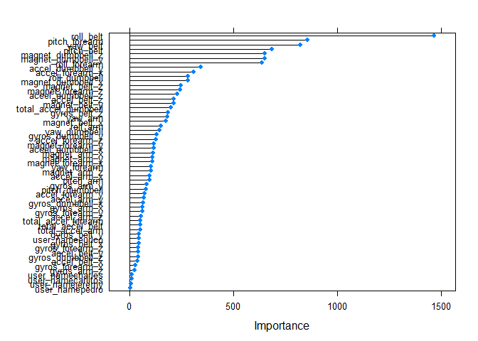

# Machine Learning: Peer Assessment

Author: iNocebo | Dominik Stämpfli  
Course: predmachlearn-033, October 2015 
 
## Executive Summary 
In this project we created a machine learning algorithm capable of distinguishing the quality of exercise execution. The prediction is based on measurements of devices applied to the belt, forearm, arm, and dumbbell during exercise execution. The random forest model with 53 predictors is capable to predict the class of execution with an out of sample error of 0.79 %. 
 
## Background 
The algorithm is trained on a dataset provided by [Velloso et al.](http://groupware.les.inf.puc-rio.br/har) (see Credits) For this dataset "six young health participants were asked to perform one set of 10 repetitions of the Unilateral Dumbbell Biceps Curl in five different fashions: exactly according to the specification (Class A), throwing the elbows to the front (Class B), lifting the dumbbell only halfway (Class C), lowering the dumbbell only halfway (Class D) and throwing the hips to the front (Class E). Class A corresponds to the specified execution of the exercise, while the other 4 classes correspond to common mistakes. Participants were supervised by an experienced weight lifter to make sure the execution complied to the manner they were supposed to simulate. The exercises were performed by six male participants aged between 20-28 years, with little weight lifting experience." [[Groupware@LES](http://groupware.les.inf.puc-rio.br/har)] 
The goal of this project was to build a model capable of distinguishing the different quality classes of unilateral dumbbell biceps curls. This report describes the exploratory data analysis, dataset processing, cross validation, model building process, model comparison and final results on the testing set. 
 
## Methods 
For this project we used RStudio version 0.98.1103 with R version 3.2.2 on Windows 7 Professional. The libraries used throughout the project were {caret} and {dplyr} (see Credits). 
 

```r
library(caret)
library(dplyr)
```

## Exploratory Data Analysis and Data Cleaning
A first quick look at the data with its 160 variables and 19'622 observations revealed features and single values which needed processing before we were able to use the dataset. A lot of processing could be done by adjusting the read-in: The error messages from Microsoft Excel *#DIV/0!*, the *NAs* represented as characters, and the empty obervations could be tackled with the argument *na.strings*. We processed the provided testing data as validation set at the same time as we wanted to use cross validation. 
 

```r
training <- read.csv("pml-training.csv", na.strings = c("#DIV/0!", "NA", ""))
validation <- read.csv("pml-testing.csv", na.strings = c("#DIV/0!", "NA", ""))
```
 
The training set contains summarized and processed data from the original researchers within certain rows (visible as *"yes"* in the variable *new_window*) which is not present in the validation set. Hence we were obliged to exclude the corresponding rows. Excluding the summary rows left the dataset with certain columns only containing *NAs*, which may be excluded as well. Furthermore we regarded the time variables as measurements only applicable to the specific setting, not providing any prediction value. We excluded the corresponding columns from further processing. We wanted to make sure that each observation except for the user names and the classe factors is represented as numeric, not hindering the algorithm. This was achieved by applying a for-loop to the dataset. 
 

```r
set.seed(1337)
## removing the summary columns
training_subset <- filter(training, new_window == "no")
## removing the time variables
training_subset <- training_subset[-c(1, 3, 4, 5, 6, 7)]
## transforming each value into numeric except for user_name and classe
for(i in c(3:ncol(training_subset)-1)) {
        training_subset[,i] = as.numeric(as.character(training_subset[,i]))
}
## defining columns with NAs
nona_columns <- colnames(training_subset[colSums(is.na(training_subset)) == 0])
training_nona <- training_subset[nona_columns]

## repeating the same procedure for the validation set.
validation_subset <- filter(validation, new_window == "no")
validation_subset <- validation_subset[-c(1, 3, 4, 5, 6, 7)]
for(i in c(3:ncol(validation_subset)-1)) {
        validation_subset[,i] = as.numeric(as.character(validation_subset[,i]))
}
nona_columns_validation <- colnames(validation_subset[colSums(is.na(validation_subset)) == 0])
validation_nona <- validation_subset[nona_columns_validation]
```
 
## Cross Validation 
We created a partition within the training set for cross validation of our models as we wanted to avoid overfitting. **We used 75 % of the training data** to create the *cross_train* training subset and the other 25 % as the *cross_test* testing subset, leaving the provided testing set as validation set aside untouched. 
 

```r
crossVal <- createDataPartition(y = training_nona$classe, p = 0.75, list = F)
cross_train <- training_nona[crossVal, ]
cross_test <- training_nona[-crossVal, ]
dim(cross_train); dim(cross_test)
```

```
## [1] 14414    54
```

```
## [1] 4802   54
```
 
## The Final Model 
For our final model with its 53 predictors we used the packet {caret} (see Credits) and the **Random Forest** method, which bootstraps the data and splits the variables into groups by checking for their homogeneity. **No preprocessing was applied**. Due to the chosen method and the use of {caret}, the model calculation was very slow, but unbeaten by its accuracy of 0,989 within *cross_train* and 0.992 within *cross_test*, providing an **in sample error of 1.1 %** (1 - accuracy) and an **out of sample error of 0.79 %**. 
 

```r
model_rf <- train(classe ~ ., data = cross_train, method = "rf")
```

 

```
## Random Forest 
## 
## 14414 samples
##    53 predictor
##     5 classes: 'A', 'B', 'C', 'D', 'E' 
## 
## No pre-processing
## Resampling: Bootstrapped (25 reps) 
## Summary of sample sizes: 14414, 14414, 14414, 14414, 14414, 14414, ... 
## Resampling results across tuning parameters:
## 
##   mtry  Accuracy   Kappa      Accuracy SD  Kappa SD   
##    2    0.9879619  0.9847670  0.001997016  0.002524420
##   29    0.9889794  0.9860553  0.001814823  0.002295131
##   57    0.9803447  0.9751274  0.002994148  0.003792975
## 
## Accuracy was used to select the optimal model using  the largest value.
## The final value used for the model was mtry = 29.
```
 

```r
pred_rf <- predict(model_rf, newdata = cross_test[-54])
confusionMatrix(pred_rf, cross_test[, 54])
```

```
## Confusion Matrix and Statistics
## 
##           Reference
## Prediction    A    B    C    D    E
##          A 1365   12    0    0    0
##          B    2  914    6    0    0
##          C    0    3  826    4    0
##          D    0    0    6  782    5
##          E    0    0    0    0  877
## 
## Overall Statistics
##                                           
##                Accuracy : 0.9921          
##                  95% CI : (0.9892, 0.9944)
##     No Information Rate : 0.2847          
##     P-Value [Acc > NIR] : < 2.2e-16       
##                                           
##                   Kappa : 0.99            
##  Mcnemar's Test P-Value : NA              
## 
## Statistics by Class:
## 
##                      Class: A Class: B Class: C Class: D Class: E
## Sensitivity            0.9985   0.9839   0.9857   0.9949   0.9943
## Specificity            0.9965   0.9979   0.9982   0.9973   1.0000
## Pos Pred Value         0.9913   0.9913   0.9916   0.9861   1.0000
## Neg Pred Value         0.9994   0.9961   0.9970   0.9990   0.9987
## Prevalence             0.2847   0.1935   0.1745   0.1637   0.1837
## Detection Rate         0.2843   0.1903   0.1720   0.1628   0.1826
## Detection Prevalence   0.2868   0.1920   0.1735   0.1651   0.1826
## Balanced Accuracy      0.9975   0.9909   0.9920   0.9961   0.9972
```
 
The features are not equally important for the model. According to the plot shown below, user_name is the least important feature in our model. 


```r
importance <- varImp(model_rf, scale = FALSE)
plot(importance)
```

 
 
## Testing the Model against the Validation Set ("Testing" within the Course Project)
20 samples (read "exercise executions") had to be classified with the use of our model. The same read-in and processing were already applied to the validation set. The last column of the validation set had to be excluded as it represents the problem id only applicable to the test and not represented in the training dataset.  

```r
pred_val <- predict(model_rf, validation_nona[-54])
print(pred_val)
```

```
##  [1] B A B A A E D B A A B C B A E E A B B B
## Levels: A B C D E
```
 
## Credits 
- Project: This project is part of Coursera's Practical Machine Learning within the "[Data Science](https://www.coursera.org/specializations/jhudatascience)" specialisation by Jeff Leek, PhD, Roger D. Peng, PhD, Brian Caffo, PhD, of Johns Hopkins University Bloomberg School of Public Health.
- [R](http://www.R-project.org): R Development Core Team (2008). R: A language and environment for statistical computing. R Foundation for Statistical Computing, Vienna, Austria. ISBN 3-900051-07-0 
- RStudio: Version 0.98.1103 
- [Weight Lifting Exercises Dataset](http://groupware.les.inf.puc-rio.br/har): Velloso, E.; Bulling, A.; Gellersen, H.; Ugulino, W.; Fuks, H. Qualitative Activity Recognition of Weight Lifting Exercises. Proceedings of 4th International Conference in Cooperation with SIGCHI (Augmented Human '13) . Stuttgart, Germany: ACM SIGCHI, 2013.
- {[ggplot2](http://had.co.nz/ggplot2/book)}: H. Wickham. ggplot2: elegant graphics for data analysis. Springer New York, 2009. 
- {[caret]((http://CRAN.R-project.org/package=caret))}: Max Kuhn. Contributions from Jed Wing, Steve Weston, Andre Williams,   Chris Keefer, Allan Engelhardt, Tony Cooper, Zachary Mayer, Brenton   Kenkel, the R Core Team, Michael Benesty, Reynald Lescarbeau, Andrew Ziem, Luca Scrucca, Yuan Tang and Can Candan. (2015). caret: Classification and Regression Training. R package version 6.0-57.
- {[dplyr](http://CRAN.R-project.org/package=dplyr)}: Hadley Wickham and Romain Francois (2015). dplyr: A Grammar of Data   Manipulation. R package version 0.4.3.
- {knitr}: Yihui Xie (2015). knitr: A General-Purpose Package for Dynamic Report Generation in R. R package
  version 1.9. 
 
## Other Models 
We tried to reduce the cross_train dataset to reduce the time of Random Forest model calculation. The models never achieved the same accuracy as our final model with 53 predictors: 
 
- The mean was calculated for each value according to groups of users and the quality of their execution (summarizing the dataset): 53 predictors with 30 samples; accuracy = 0.355. 

```r
summarized <- aggregate(cross_train, by= list(cross_train$user_name,
                                              cross_train$classe), FUN = mean)
summarized$user_name <- summarized$Group.1
summarized$classe <- summarized$Group.2
summarized <- summarized[-c(1, 2)]
```
 
- Eliminating redundant (correlation > 0.5) features with {caret}'s *findCorrelation*: 22 predictors with 14414 samples; accuracy: 0.969. 

```r
correlationMatrix <- cor(cross_train[, 2:53])
highlyCorrelated <- findCorrelation(correlationMatrix, cutoff=0.5)
cross_train_reduced <- cross_train[-c(1 +highlyCorrelated)]
print(colnames(cross_train[-c(1 +highlyCorrelated)]))
```

```
##  [1] "user_name"           "gyros_belt_x"        "gyros_belt_y"       
##  [4] "gyros_belt_z"        "magnet_belt_y"       "roll_arm"           
##  [7] "yaw_arm"             "total_accel_arm"     "gyros_arm_y"        
## [10] "gyros_arm_z"         "magnet_arm_x"        "roll_dumbbell"      
## [13] "pitch_dumbbell"      "roll_forearm"        "pitch_forearm"      
## [16] "yaw_forearm"         "total_accel_forearm" "gyros_forearm_x"    
## [19] "gyros_forearm_y"     "accel_forearm_z"     "magnet_forearm_x"   
## [22] "magnet_forearm_y"    "classe"
```
 
- Eliminating redundant (correlation > 0.75) features with {caret}'s *findCorrelation*: 34 predictors with 14414 samples; accuracy: 0.987. 

```r
corr75 <- findCorrelation(correlationMatrix, cutoff = 0.75)
colnames(cross_train)[1 + corr75]
```

```
##  [1] "accel_belt_z"      "roll_belt"         "accel_belt_y"     
##  [4] "total_accel_belt"  "accel_dumbbell_z"  "accel_belt_x"     
##  [7] "pitch_belt"        "magnet_dumbbell_x" "accel_dumbbell_y" 
## [10] "magnet_dumbbell_y" "accel_arm_x"       "accel_dumbbell_x" 
## [13] "accel_arm_z"       "magnet_arm_y"      "magnet_belt_z"    
## [16] "accel_forearm_y"   "gyros_forearm_y"   "gyros_dumbbell_x" 
## [19] "gyros_dumbbell_z"  "gyros_arm_x"
```
